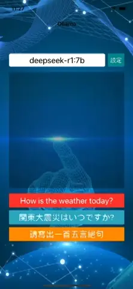

# WWSimpleAI+Ollama

[](https://developer.apple.com/swift/) [](https://developer.apple.com/swift/)  [](https://developer.apple.com/swift/) [](https://developer.apple.com/swift/)

## [Introduction - 簡介](https://swiftpackageindex.com/William-Weng)
- [Simple connection to Ollama API functionality.](https://github.com/ollama/ollama/blob/main/docs/api.md)
- [簡單連接Ollama API。](https://dribbble.com/shots/22339104-Crab-Loading-Gif)



### [Installation with Swift Package Manager](https://medium.com/彼得潘的-swift-ios-app-開發問題解答集/使用-spm-安裝第三方套件-xcode-11-新功能-2c4ffcf85b4b)
```
dependencies: [
    .package(url: "https://github.com/William-Weng/WWSimpleAI_Ollama.git", .upToNextMajor(from: "1.1.6"))
]
```

## [Function - 可用函式](https://william-weng.github.io/2025/01/docker容器大家一起來當鯨魚搬運工吧/)
|函式|功能|
|-|-|
|version(type:using:separator:)|取得版本號|
|models()|取得已下載模型列表|
|document(model:isVerbose:)|取得模型文件說明|
|copy(source:destination:)|複製模型|
|delete(model:)|刪除已下載模型|
|download(model:type:timeout:useStream:using:eparator:)|下載模型|
|configure(baseURL:model:jpegCompressionQuality:)|相關參數設定|
|loadIntoMemory(api:isLoad:type:using:)|載入模型到記憶體的設定 - 開 / 關|
|generate(prompt:context:type:timeout:format:images:options:useStream:using:)|一次性回應 (每次請求都是獨立的)|
|talk(content:type:timeout:format:useStream:images:options:tools:using:)|說話模式 (會記住之前的對話內容)|
|chat(messages:type:timeout:format:useStream:options:images:tools:using:)|對話模式 (會記住之前的對話內容)|
|create(newModel:from:personality:type:useStream:using)|建立客製化模型|
|embed(model:inputs:type:timeout:using:separator:)|從模型生成嵌入文字|

## [Example](https://ezgif.com/video-to-webp)
```swift/Users/ios/Desktop/WWSimpleAI_Ollama/Package.swift
import UIKit
import WWHUD
import WWEventSource
import WWSimpleAI_Ollama

final class ViewController: UIViewController {
    
    @IBOutlet weak var modelTextField: UITextField!
    @IBOutlet weak var resultTextView: UITextView!
    
    private let baseURL = "http://localhost:11434"
    
    private var isDismiss = false
    private var responseString: String = ""
    
    @IBAction func configureModel(_ sender: UIButton) {
        Task { await initLoadModelIntoMemory() }
    }
    
    @IBAction func generateDemo(_ sender: UIButton) {
        Task { await generate(prompt: "\(sender.title(for: .normal)!)") }
    }
    
    @IBAction func talkDemo(_ sender: UIButton) {
        Task { await talk(content: "\(sender.title(for: .normal)!)") }
    }
        
    @IBAction func generateLiveDemo(_ sender: UIButton) {
        liveGenerate(prompt: "\(sender.title(for: .normal)!)")
    }
}

extension ViewController: WWEventSource.Delegate {
    
    func serverSentEventsConnectionStatus(_ eventSource: WWEventSource, result: Result<WWEventSource.ConnectionStatus, any Error>) {
        sseStatusAction(eventSource: eventSource, result: result)
    }
    
    func serverSentEventsRawString(_ eventSource: WWEventSource, result: Result<WWEventSource.RawInformation, any Error>) {
                
        switch result {
        case .failure(let error): displayText(error)
        case .success(let rawInformation): sseRawString(eventSource: eventSource, rawInformation: rawInformation)
        }
    }
    
    func serverSentEvents(_ eventSource: WWEventSource, eventValue: WWEventSource.EventValue) {
        print(eventValue)
    }
}

private extension ViewController {
    
    func initLoadModelIntoMemory() async {
        
        displayHUD()
        configure()
        
        let result = await WWSimpleAI.Ollama.shared.loadIntoMemory(api: .generate)
        
        switch result {
        case .failure(let error): displayText(error.localizedDescription)
        case .success(let responseType): diplayResponse(type: responseType)
        }
        
        WWHUD.shared.dismiss()
    }
    
    func generate(prompt: String) async {
        
        displayHUD()
        
        let result = await WWSimpleAI.Ollama.shared.generate(prompt: prompt)
        
        switch result {
        case .failure(let error): displayText(error.localizedDescription)
        case .success(let responseType): diplayResponse(type: responseType)
        }
        
        WWHUD.shared.dismiss()
    }
    
    func talk(content: String) async {
        
        displayHUD()
        
        let result = await WWSimpleAI.Ollama.shared.talk(content: content)
        
        switch result {
        case .failure(let error): displayText(error.localizedDescription)
        case .success(let responseType): diplayResponse(type: responseType)
        }
        
        WWHUD.shared.dismiss()
    }
    
    func liveGenerate(prompt: String) {
        
        displayHUD()
        
        let urlString = WWSimpleAI.Ollama.API.generate.url()
        let json = """
        {
          "model": "\(WWSimpleAI.Ollama.model)",
          "prompt": "\(prompt)",
          "stream": true
        }
        """
        
        _ = WWEventSource.shared.connect(httpMethod: .POST, delegate: self, urlString: urlString, httpBodyType: .string(json))
    }
}

private extension ViewController {
    
    func configure() {
        guard let model = modelTextField.text else { return }
        WWSimpleAI.Ollama.configure(baseURL: baseURL, model: model)
    }
    
    func diplayResponse(type: WWSimpleAI.Ollama.ResponseType) {
        
        switch type {
        case .string(let string): displayText(string)
        case .data(let data): displayText(data)
        case .ndjson(let ndjson): displayText(ndjson)
        }
    }
    
    func displayHUD() {
        resultTextView.text = ""
        WWHUD.shared.display()
    }
    
    func displayText(_ value: Any?) {
        resultTextView.text = "\(value ?? "")"
    }
}

private extension ViewController {
    
    func sseStatusAction(eventSource: WWEventSource, result: Result<WWEventSource.ConnectionStatus, any Error>) {
        
        switch result {
        case .failure(let error):
            
            DispatchQueue.main.async { [unowned self] in
                WWHUD.shared.dismiss()
                displayText(error.localizedDescription)
                isDismiss = true
                responseString = ""
            }
            
        case .success(let status):
            
            switch status {
            case .connecting: isDismiss = false
            case .open: if !isDismiss { DispatchQueue.main.async { [unowned self] in WWHUD.shared.dismiss(); isDismiss = true }}
            case .closed: responseString = ""; isDismiss = false
            }
        }
    }
    
    func sseRawString(eventSource: WWEventSource, rawInformation: WWEventSource.RawInformation) {
        
        defer {
            DispatchQueue.main.async { [unowned self] in
                resultTextView.text = responseString
                resultTextView._autoScrollToBottom()
            }
        }
        
        if rawInformation.response.statusCode != 200 { responseString = rawInformation.string; return }
        
        guard let jsonObject = rawInformation.string._data()?._jsonObject() as? [String: Any],
              let _response = jsonObject["response"] as? String
        else {
            return
        }
        
        responseString += _response
    }
}
```
